# Database Schema and Data Management

This document provides a comprehensive guide to the database architecture, data definitions, relationship patterns, and CRUD data flows implemented within the **Stone-Cap Finance System**. 

The system operates a multi-microservice architecture built on **NestJS** and backed by a single hardened **PostgreSQL (v15)** relational database, managed using the **Prisma ORM**.

---

## 1. Database Architecture & Technology Stack

The database layer is configured with the following characteristics:
*   **Database Engine**: PostgreSQL 15 (Alpine-based Docker container).
*   **Object-Relational Mapping (ORM)**: Prisma.
*   **State Management**: Auto-migration records with Prisma Client js generation.
*   **Concurrency & Data Integrity**: High-frequency transactional updates (e.g., balance ledger adjustments, disbursements, collections) are wrapped in atomic database transactions (`prisma.$transaction`) with strict read/write locks.
*   **Referential Integrity Constraints**: Cascading deletes are disabled globally (`onDelete: Restrict`) on crucial tables to protect financial audits and transaction history.

---

## 2. Entity-Relationship Diagram (ERD)

The following Mermaid diagram maps out the relationships, data types, and primary-foreign key structures of the entities in the system.

```mermaid
erDiagram
    USER ||--o{ FS_AUDIT_LOG : "triggers (user_id)"
    USER ||--o{ REPORT_SIGNOFF : "signs (user_id)"
    FUND ||--o{ FUND_TRANSACTION : "contains (fund_id)"
    FUND ||--o{ DISBURSEMENT_REQUEST : "funds (fund_id)"
    EXPENSE_VOUCHER ||--o{ PETTY_CASH_TRANSACTION : "references (reference_voucher_id)"

    USER {
        string id PK
        string email UK
        string password
        SystemRole role
        datetime createdAt
        datetime updatedAt
    }

    FS_AUDIT_LOG {
        string id PK
        string user_id FK
        ActionType action_type
        string table_name
        string record_id
        json old_value_json
        json new_value_json
        string ip_address
        datetime timestamp
    }

    REPORT_SIGNOFF {
        string id PK
        string report_id
        string user_id FK
        SystemRole role
        string digital_sig
        datetime signed_at
    }

    FUND {
        string id PK
        string name UK
        string code UK
        decimal balance
        datetime createdAt
        datetime updatedAt
    }

    FUND_TRANSACTION {
        string id PK
        string fund_id FK
        decimal amount
        FundTxType type
        string description
        string reference_id
        datetime timestamp
    }

    DISBURSEMENT_REQUEST {
        string id PK
        string loan_reference UK
        string member_id
        string member_name
        decimal amount
        PaymentMethod payment_method
        string bank_account
        string payment_details
        DisbursementStatus status
        string authorized_by
        datetime created_at
        datetime updated_at
        string fund_id FK
    }

    LOAN_REPAYMENT {
        string id PK
        string loan_reference
        string member_id
        string member_name
        decimal amount
        decimal principal_amount
        decimal service_fee_amount
        decimal overpayment_amount
        PaymentMethod payment_method
        string reference_number
        RepaymentStatus status
        TreasurerDecision treasurer_decision
        datetime processed_at
        datetime created_at
        datetime updated_at
    }

    LOAN_WRITE_OFF {
        string id PK
        string loan_reference UK
        string member_id
        string member_name
        decimal amount
        string reason
        WriteOffStatus status
        string requested_by
        string authorized_by
        datetime created_at
        datetime updated_at
    }

    DUES_RECORD {
        string id PK
        string transaction_id UK
        string member_id
        string name
        string month
        decimal amount_paid
        PaymentMethod method
        string reference_number
        string fund_to_credit
        DuesStatus status
        CollectionType collection_type
        datetime created_at
        datetime updated_at
    }

    EXPENSE_VOUCHER {
        string id PK
        string voucher_number UK
        datetime date
        string payee
        string purpose
        decimal amount
        string account_code
        string approved_by
        VoucherStatus status
        string receipt_url
        datetime posted_at
        string notes
        datetime created_at
        datetime updated_at
    }

    PETTY_CASH_TRANSACTION {
        string id PK
        PettyCashType type
        decimal amount
        string description
        decimal running_balance
        string reference_voucher_id FK
        datetime transacted_at
        datetime created_at
    }

    BUDGET_CATEGORY {
        string id PK
        string account_code UK
        string account_name
        decimal approved_amount
        int fiscal_year UK
    }
```



---

## 3. Data Dictionary & Table Structures

This dictionary details every field, enum, validation rule, and database constraint. All financial amounts utilize the PostgreSQL `Decimal(12, 2)` type for absolute mathematical precision.

### 3.1. System Enums

| Enum Name | Allowed Values | Description |
| :--- | :--- | :--- |
| **SystemRole** | `USER`, `ADMIN`, `TREASURER`, `PRESIDENT` | System authorization level. |
| **ActionType** | `POST`, `PUT`, `DELETE` | Used to categorize actions in the audit trail. |
| **FundTxType** | `DEPOSIT`, `WITHDRAWAL`, `LOAN_DISBURSEMENT`, `CORRECTING_ENTRY` | Categorizes transaction types inside the core funds ledger. |
| **PaymentMethod** | `BANK_TRANSFER`, `CHECK`, `CASH`, `SALARY_DEDUCTION` | Supported payment methods for disbursements/collections. |
| **DisbursementStatus** | `PENDING`, `APPROVED`, `COMPLETED`, `REJECTED` | Life cycle status of a disbursement request. |
| **RepaymentStatus** | `PROCESSED`, `OVERPAYMENT_PENDING`, `OVERPAYMENT_CREDITED`, `OVERPAYMENT_REFUNDED` | Life cycle status of loan repayments. |
| **TreasurerDecision** | `NONE`, `ADVANCE_CREDIT`, `REFUND` | Resolution of loan overpayment scenarios. |
| **WriteOffStatus** | `PENDING`, `APPROVED`, `REJECTED` | Approval stage of a loan write-off. |
| **DuesStatus** | `PENDING`, `CONFIRMED` | Life cycle of member dues and contribution collections. |
| **CollectionType** | `DUES`, `LOAN_PAYMENT`, `CONTRIBUTION` | Categorization of external payments collected from members. |
| **VoucherStatus** | `PENDING`, `APPROVED`, `REJECTED`, `POSTED` | Processing cycle of an expense voucher. |
| **PettyCashType** | `REPLENISHMENT`, `DISBURSEMENT`, `OPENING_BALANCE`, `RECONCILIATION` | Categorization of petty cash ledger movements. |

---

### 3.2. Table: `User` (System Users & Mock Members)
Stores credentials and access roles. Member records are synced or loaded as `USER` accounts with their member ID (e.g., `M-2023-112`) as their primary identifier/email.

*   **Primary Key**: `id` (UUIDv4)
*   **Unique Constraint**: `email`

| Column | Data Type | Nullable | Default | Description / Rule | Example |
| :--- | :--- | :--- | :--- | :--- | :--- |
| `id` | `VARCHAR(36)` | No | `uuid()` | System-generated UUID. | `"5f8d9a2c-7b1e-42c3..."` |
| `email` | `VARCHAR(255)`| No | *None* | Login identifier (or Member ID). | `"admin"`, `"M-2023-112"` |
| `password` | `VARCHAR(255)`| No | *None* | Hashed string. | `"$2b$10$xyz..."` |
| `role` | `SystemRole` | No | `USER` | Roles mapping to security gates. | `ADMIN` |
| `createdAt` | `TIMESTAMP` | No | `now()` | Record creation timestamp. | `2026-06-19T18:41:37Z` |
| `updatedAt` | `TIMESTAMP` | No | *Auto* | Record update timestamp. | `2026-06-19T19:28:31Z` |

---

### 3.3. Table: `fs_audit_log` (`FSAuditLog`)
Tracks administrative operations, capturing historical states for recovery and security audits.

*   **Primary Key**: `id` (UUIDv4)
*   **Foreign Key**: `user_id` -> `User(id)` (`onDelete: Restrict`)

| Column | Data Type | Nullable | Default | Description / Rule | Example |
| :--- | :--- | :--- | :--- | :--- | :--- |
| `id` | `VARCHAR(36)` | No | `uuid()` | Unique log ID. | `"a8df810b-6c4a..."` |
| `user_id` | `VARCHAR(36)` | Yes | `null` | References the user enacting the change. | `"u-treasurer-001"` |
| `action_type` | `ActionType` | No | *None* | Operation nature (CRUD). | `POST` |
| `table_name` | `VARCHAR(255)`| No | *None* | Modified database table. | `"expense_vouchers"` |
| `record_id` | `VARCHAR(255)`| No | *None* | Primary key value of target record. | `"v-2026-001"` |
| `old_value_json`| `JSONB` | Yes | `null` | Entity data before modification. | `{"status": "PENDING"}` |
| `new_value_json`| `JSONB` | Yes | `null` | Entity data after modification. | `{"status": "APPROVED"}` |
| `ip_address` | `VARCHAR(45)` | Yes | `null` | IP address of request context. | `"192.168.1.10"` |
| `timestamp` | `TIMESTAMP` | No | `now()` | Log creation time. | `2026-06-19T19:28:31Z` |

---

### 3.4. Table: `report_signoffs` (`ReportSignoff`)
Maintains cryptographic or digital signoffs for generated reports.

*   **Primary Key**: `id` (UUIDv4)
*   **Foreign Key**: `user_id` -> `User(id)` (`onDelete: Restrict`)

| Column | Data Type | Nullable | Default | Description / Rule | Example |
| :--- | :--- | :--- | :--- | :--- | :--- |
| `id` | `VARCHAR(36)` | No | `uuid()` | Log ID. | `"928e71b2-11bc..."` |
| `report_id` | `VARCHAR(255)`| No | *None* | Unique report name or month. | `"REPORT-JUNE-2026"` |
| `user_id` | `VARCHAR(36)` | No | *None* | Signee user reference. | `"u-president-001"` |
| `role` | `SystemRole` | No | *None* | Capacity in which the signoff occurred. | `PRESIDENT` |
| `digital_sig` | `VARCHAR(255)`| No | *None* | Digitally signed metadata or signature tag. | `"SIG-PRES-998812"` |
| `signed_at` | `TIMESTAMP` | No | `now()` | Timestamp of digital signature. | `2026-06-19T19:20:00Z` |

---

### 3.5. Table: `funds` (`Fund`)
Core ledger bins managing money allocated for different activities (e.g., Loans, General Fund).

*   **Primary Key**: `id` (UUIDv4)
*   **Unique Constraints**: `name`, `code`

| Column | Data Type | Nullable | Default | Description / Rule | Example |
| :--- | :--- | :--- | :--- | :--- | :--- |
| `id` | `VARCHAR(36)` | No | `uuid()` | Fund unique ID. | `"GF"` |
| `name` | `VARCHAR(255)`| No | *None* | Clear text name of fund. | `"General Fund"` |
| `code` | `VARCHAR(50)` | No | *None* | System short code (GF, LN, etc.) | `"GF"`, `"LN"` |
| `balance` | `DECIMAL(12,2)`| No | `0.00` | Liquid balance, must be precise. | `1812350.00` |
| `createdAt` | `TIMESTAMP` | No | `now()` | Record creation. | `2026-06-19T19:00:00Z` |
| `updatedAt` | `TIMESTAMP` | No | *Auto* | Balance updates auto-refresh this. | `2026-06-19T19:28:31Z` |

---

### 3.6. Table: `fund_transactions` (`FundTransaction`)
Append-only history of financial movements inside the different funds. Serves as the double-entry confirmation trail.

*   **Primary Key**: `id` (UUIDv4)
*   **Foreign Key**: `fund_id` -> `Fund(id)` (`onDelete: Restrict`)
*   **Index**: `[fund_id]`

| Column | Data Type | Nullable | Default | Description / Rule | Example |
| :--- | :--- | :--- | :--- | :--- | :--- |
| `id` | `VARCHAR(36)` | No | `uuid()` | Transaction identifier. | `"tx-uuid-8812"` |
| `fund_id` | `VARCHAR(36)` | No | *None* | Linked Fund record. | `"LN"` |
| `amount` | `DECIMAL(12,2)`| No | *None* | Amount. Negative for withdrawals. | `-30000.00` |
| `type` | `FundTxType` | No | *None* | Ledger entry type. | `LOAN_DISBURSEMENT` |
| `description` | `VARCHAR(255)`| No | *None* | Auditable summary. | `"Disbursement: DELA CRUZ, JUAN"` |
| `reference_id`| `VARCHAR(255)`| Yes | `null` | External/Internal system code (e.g., Loan Ref).| `"LN-2026-071"` |
| `timestamp` | `TIMESTAMP` | No | `now()` | Transaction execution date. | `2026-06-19T19:28:31Z` |

---

### 3.7. Table: `disbursement_requests` (`DisbursementRequest`)
Records disbursement instructions issued for approved loans. Once approved by the Treasurer, the loan funds are moved and status transitions.

*   **Primary Key**: `id` (UUIDv4)
*   **Unique Constraint**: `loan_reference`
*   **Foreign Key**: `fund_id` -> `Fund(id)` (`onDelete: Restrict`)

| Column | Data Type | Nullable | Default | Description / Rule | Example |
| :--- | :--- | :--- | :--- | :--- | :--- |
| `id` | `VARCHAR(36)` | No | `uuid()` | Record UUID. | `"disb-9988"` |
| `loan_reference`| `VARCHAR(255)`| No | *None* | Ext. reference to the Loan Application. | `"LN-2026-071"` |
| `member_id` | `VARCHAR(50)` | No | *None* | Target Member ID. | `"M-2023-112"` |
| `member_name` | `VARCHAR(255)`| No | *None* | Full name of recipient member. | `"DELA CRUZ, JUAN"` |
| `amount` | `DECIMAL(12,2)`| No | *None* | Amount disbursed. | `30000.00` |
| `payment_method`| `PaymentMethod`| No | *None* | Payment method. | `BANK_TRANSFER` |
| `bank_account`| `VARCHAR(255)`| No | *None* | Bank account details or "CASH"/"CHECK" code.| `"BDO-0011-3344-55"` |
| `payment_details`|`VARCHAR(255)`| Yes | `null` | Supplementary processing notes. | `"June payroll run"` |
| `status` | `DisbursementStatus`|No| `PENDING`| Life cycle of disbursement. | `COMPLETED` |
| `authorized_by`| `VARCHAR(255)`| Yes | `null` | Signoff name/email. | `"Treasurer Amante"` |
| `fund_id` | `VARCHAR(36)` | No | *None* | Billed fund source. | `"LN"` |
| `created_at` | `TIMESTAMP` | No | `now()` | Date requested. | `2026-04-26T10:00:00Z` |
| `updated_at` | `TIMESTAMP` | No | *Auto* | State update date. | `2026-04-26T12:30:00Z` |

---

### 3.8. Table: `loan_repayments` (`LoanRepayment`)
Records repayments against active loans, handling core math regarding principal allocation, service fees, and overpayment calculations.

*   **Primary Key**: `id` (UUIDv4)

| Column | Data Type | Nullable | Default | Description / Rule | Example |
| :--- | :--- | :--- | :--- | :--- | :--- |
| `id` | `VARCHAR(36)` | No | `uuid()` | Record UUID. | `"repay-uuid-009"` |
| `loan_reference`| `VARCHAR(255)`| No | *None* | Target Loan code. | `"LN-2026-071"` |
| `member_id` | `VARCHAR(50)` | No | *None* | Member identification. | `"M-2023-112"` |
| `member_name` | `VARCHAR(255)`| No | *None* | Full name. | `"DELA CRUZ, JUAN"` |
| `amount` | `DECIMAL(12,2)`| No | *None* | Total payment amount processed. | `5500.00` |
| `principal_amount`|`DECIMAL(12,2)`|No| *None* | Portion applied to main loan balance. | `5000.00` |
| `service_fee_amount`|`DECIMAL(12,2)`|No| *None* | Portion applied to processing/interest fees.| `500.00` |
| `overpayment_amount`|`DECIMAL(12,2)`|No| `0.00` | Tracked surplus if payment > remaining. | `0.00` |
| `payment_method`| `PaymentMethod`| No | *None* | Payment method. | `SALARY_DEDUCTION` |
| `reference_number`| `VARCHAR(255)`| Yes | `null` | External deposit receipt reference. | `"REF-PAY-8822"` |
| `status` | `RepaymentStatus`|No| `PROCESSED`| Lifecycle of repayment allocation. | `PROCESSED` |
| `treasurer_decision`|`TreasurerDecision`|No| `NONE`| Action taken if overpayment exists. | `NONE` |
| `processed_at`| `TIMESTAMP` | No | `now()` | Date the system recorded payment. | `2026-05-05T14:00:00Z` |
| `created_at` | `TIMESTAMP` | No | `now()` | Database entry time. | `2026-05-05T14:00:00Z` |
| `updated_at` | `TIMESTAMP` | No | *Auto* | Last adjustment time. | `2026-05-05T14:00:00Z` |

---

### 3.9. Table: `loan_write_offs` (`LoanWriteOff`)
Logs write-off approvals of uncollectible or defaulted loans.

*   **Primary Key**: `id` (UUIDv4)
*   **Unique Constraint**: `loan_reference`

| Column | Data Type | Nullable | Default | Description / Rule | Example |
| :--- | :--- | :--- | :--- | :--- | :--- |
| `id` | `VARCHAR(36)` | No | `uuid()` | Record UUID. | `"wo-8821"` |
| `loan_reference`| `VARCHAR(255)`| No | *None* | Reference to written-off loan. | `"LN-2026-080"` |
| `member_id` | `VARCHAR(50)` | No | *None* | Member identifier. | `"M-2018-099"` |
| `member_name` | `VARCHAR(255)`| No | *None* | Written-off debtor's name. | `"RAMIREZ, DANTE G."` |
| `amount` | `DECIMAL(12,2)`| No | *None* | Written-off amount. | `25000.00` |
| `reason` | `TEXT` | No | *None* | Detailed reason for write-off. | `"Debtor passed away; unrecoverable"`|
| `status` | `WriteOffStatus`|No | `PENDING` | Current state of approval. | `PENDING` |
| `requested_by`| `VARCHAR(255)`| No | *None* | Requesting staff member. | `"Auditor Ramos"` |
| `authorized_by`| `VARCHAR(255)`| Yes | `null` | Approving President signature. | `"President Vinluan"` |
| `created_at` | `TIMESTAMP` | No | `now()` | Request submission date. | `2026-06-18T10:00:00Z` |
| `updated_at` | `TIMESTAMP` | No | *Auto* | Approval state change timestamp. | `2026-06-18T10:00:00Z` |

---

### 3.10. Table: `dues_records` (`DuesRecord`)
Stores dues collection entries uploaded via payroll batch sheets or posted manually.

*   **Primary Key**: `id` (UUIDv4)
*   **Unique Constraint**: `transaction_id`

| Column | Data Type | Nullable | Default | Description / Rule | Example |
| :--- | :--- | :--- | :--- | :--- | :--- |
| `id` | `VARCHAR(36)` | No | `uuid()` | Record UUID. | `"dues-rec-1"` |
| `transaction_id`| `VARCHAR(255)`| No | *None* | Transaction ID from payroll/collection system. | `"TXN-COL-889988"` |
| `member_id` | `VARCHAR(50)` | No | *None* | Member reference. | `"M-2023-112"` |
| `name` | `VARCHAR(255)`| No | *None* | Full name. | `"DELA CRUZ, JUAN"` |
| `month` | `VARCHAR(50)` | No | *None* | Period covered. | `"June 2026"` |
| `amount_paid` | `DECIMAL(12,2)`| No | *None* | Remitted amount. | `5500.00` |
| `method` | `PaymentMethod`| No | *None* | Method used to remit funds. | `SALARY_DEDUCTION` |
| `reference_number`|`VARCHAR(255)`| Yes | `null` | Bank/Transaction reference. | `"DEP-998812"` |
| `fund_to_credit`| `VARCHAR(50)` | No | *None* | Targeted short code of Fund. | `"GF"` |
| `status` | `DuesStatus` | No | `PENDING` | Confirmed/Pending status of remittance. | `PENDING` |
| `collection_type`|`CollectionType`|No | `DUES` | Nature of payment collected. | `LOAN_PAYMENT` |
| `created_at` | `TIMESTAMP` | No | `now()` | Record upload date. | `2026-06-19T19:00:00Z` |
| `updated_at` | `TIMESTAMP` | No | *Auto* | Record confirmation timestamp. | `2026-06-19T19:28:31Z` |

---

### 3.11. Table: `expense_vouchers` (`ExpenseVoucher`)
Houses expense claims and purchase vouchers. Integrates with Budget Ceilings check before allowing postings.

*   **Primary Key**: `id` (UUIDv4)
*   **Unique Constraint**: `voucher_number`

| Column | Data Type | Nullable | Default | Description / Rule | Example |
| :--- | :--- | :--- | :--- | :--- | :--- |
| `id` | `VARCHAR(36)` | No | `uuid()` | Record UUID. | `"vouch-99"` |
| `voucher_number`|`VARCHAR(255)` | No | *None* | Unique manual voucher number reference. | `"EV-2026-05"` |
| `date` | `TIMESTAMP` | No | *None* | Invoice date. | `2026-06-19T00:00:00Z` |
| `payee` | `VARCHAR(255)`| No | *None* | Vendor or employee being paid. | `"National Bookstore"` |
| `purpose` | `VARCHAR(255)`| No | *None* | Description of purchase. | `"Office printing supplies"` |
| `amount` | `DECIMAL(12,2)`| No | *None* | Total expense amount. | `4500.00` |
| `account_code` | `VARCHAR(50)` | No | *None* | Linked chart of accounts code. | `"EXP-OFF"` |
| `approved_by` | `VARCHAR(255)`| Yes | `null` | Approving executive (e.g. President). | `"President Vinluan"` |
| `status` | `VoucherStatus`|No | `PENDING` | Phase of approval and accounting entry. | `POSTED` |
| `receipt_url` | `VARCHAR(512)`| Yes | `null` | Path or Cloud URL to scanned receipt. | `"/uploads/receipt-1.jpg"` |
| `postedAt` | `TIMESTAMP` | Yes | `null` | Date posted to General Ledger. | `2026-06-19T19:28:31Z` |
| `notes` | `TEXT` | Yes | `null` | Remarks. | `"Urgent print job for reports"` |
| `created_at` | `TIMESTAMP` | No | `now()` | Entry creation. | `2026-06-19T18:00:00Z` |
| `updated_at` | `TIMESTAMP` | No | *Auto* | State update. | `2026-06-19T19:28:31Z` |

---

### 3.12. Table: `petty_cash_transactions` (`PettyCashTransaction`)
Ledger tracking cash on hand. Disbursements require a linked `ExpenseVoucher` to be approved or posted.

*   **Primary Key**: `id` (UUIDv4)
*   **Foreign Key**: `reference_voucher_id` -> `ExpenseVoucher(id)` (`onDelete: Restrict`)

| Column | Data Type | Nullable | Default | Description / Rule | Example |
| :--- | :--- | :--- | :--- | :--- | :--- |
| `id` | `VARCHAR(36)` | No | `uuid()` | Transaction UUID. | `"pt-8822"` |
| `type` | `PettyCashType`|No | *None* | Operation. | `DISBURSEMENT` |
| `amount` | `DECIMAL(12,2)`| No | *None* | Positive absolute amount. | `1500.00` |
| `description` | `VARCHAR(255)`| No | *None* | Ledger entry details. | `"Petty cash for office snacks"` |
| `running_balance`|`DECIMAL(12,2)`|No | *None* | Calculated balance post-transaction. | `8500.00` |
| `reference_voucher_id`|`VARCHAR(36)`|Yes| `null` | Linked Expense Voucher. | `"vouch-99"` |
| `transacted_at`| `TIMESTAMP` | No | `now()` | Execution timestamp. | `2026-06-19T19:20:00Z` |
| `created_at` | `TIMESTAMP` | No | `now()` | Record creation. | `2026-06-19T19:20:00Z` |

---

### 3.13. Table: `budget_categories` (`BudgetCategory`)
Defines the yearly financial boundaries for various expense accounts, safeguarding against overspending.

*   **Primary Key**: `id` (UUIDv4)
*   **Unique Index**: `[accountCode, fiscalYear]`

| Column | Data Type | Nullable | Default | Description / Rule | Example |
| :--- | :--- | :--- | :--- | :--- | :--- |
| `id` | `VARCHAR(36)` | No | `uuid()` | Category UUID. | `"bc-9921"` |
| `account_code` | `VARCHAR(50)` | No | *None* | Code of category. | `"EXP-OFF"` |
| `account_name` | `VARCHAR(255)`| No | *None* | Friendly description. | `"Office Expenses"` |
| `approved_amount`|`DECIMAL(12,2)`|No | *None* | Max spending limit allowed for year. | `50000.00` |
| `fiscal_year` | `INT` | No | *None* | Active year (YYYY). | `2026` |
| `created_at` | `TIMESTAMP` | No | `now()` | Boundary created. | `2026-01-01T00:00:00Z` |
| `updated_at` | `TIMESTAMP` | No | *Auto* | Boundary adjusted. | `2026-01-10T12:00:00Z` |

---

## 4. Core CRUD Operations & Data Flows

Database changes are managed in NestJS services via Prisma Client. The following highlights how data is written, manipulated, and queried for major business workflows.

### 4.1. Dues Collection & Loan Repayment Allocation Flow
*   **Read Operation**: The queue reads member ledger info.
*   **Transaction Flow (Create/Update)**:
    1. A payroll collection is submitted (e.g. type `LOAN_PAYMENT` or `DUES`).
    2. Within a `prisma.$transaction`, if `LOAN_PAYMENT`, the system queries the active `DisbursementRequest` for the member (`status: COMPLETED`).
    3. The outstanding loan balance (stored in `amount`) is decremented by the collected payment.
    4. A new pending `DuesRecord` is created inside the database.
    5. Upon manual confirmation by the Treasurer, the dues record transitions to `CONFIRMED`, triggers RabbitMQ event `fund.dues.posted` to update General Ledger balances, and emits `repayment.received` to record a permanent record in `LoanRepayment`.

**Prisma Implementation Snippet (from `dues.service.ts`):**
```typescript
await this.prisma.$transaction(async (tx) => {
  if (collectionType === 'LOAN_PAYMENT') {
    // Find active completed loan
    const activeLoan = await tx.disbursementRequest.findFirst({
      where: { memberId, status: 'COMPLETED' },
      orderBy: { createdAt: 'desc' }
    });
    if (!activeLoan) throw new BadRequestException('No active loan found');
    
    // Deduct from outstanding balance
    const newBalance = Math.max(0, Number(activeLoan.amount) - Number(amount));
    await tx.disbursementRequest.update({
      where: { id: activeLoan.id },
      data: { amount: newBalance }
    });
  }

  // Create Dues/Collection record
  return tx.duesRecord.create({
    data: { transactionId, memberId, name, amountPaid: amount, status: 'PENDING', collectionType }
  });
});
```

---

### 4.2. Loan Disbursement Execution Flow
*   **Create Operation**: Initialized via RabbitMQ on event `loan.approved` emitted from the Loan application.
*   **Transaction Flow**:
    1. System intercepts approval event, finding the appropriate Fund matching `LOAN_BDOEA` (short code `LN`).
    2. Subtracts the principal amount from the corresponding Fund's balance.
    3. Appends a withdrawal transaction to `FundTransaction`.
    4. Appends a new `DisbursementRequest` marked as `PENDING`.
    5. When the Treasurer releases the funds, they update the `status` to `COMPLETED` and record their signature in `authorizedBy`.
    6. If the Treasurer rejects the release, the transaction is reversed atomically: status updates to `REJECTED`, fund balance is incremented back, and a `CORRECTING_ENTRY` is generated in `FundTransaction`.

**Prisma Implementation Snippet (from `disbursements.service.ts`):**
```typescript
// On Reject: Reverse and credit back
await this.prisma.$transaction(async (tx) => {
  await tx.disbursementRequest.update({
    where: { id },
    data: { status: 'REJECTED', authorizedBy }
  });

  await tx.fund.update({
    where: { id: record.fundId },
    data: { balance: { increment: record.amount } },
  });

  await tx.fundTransaction.create({
    data: {
      fundId: record.fundId,
      amount: record.amount,
      type: 'CORRECTING_ENTRY',
      description: `Disbursement Rejected: reversed ₱${record.amount} for ${record.memberName}`
    }
  });
});
```

---

### 4.3. Expense Voucher & Petty Cash Integration Flow
*   **Budget Ceiling Verification (Read)**: 
    When an Approved voucher is requested to be Posted:
    1. System computes the fiscal year of the voucher.
    2. Sums all already `POSTED` vouchers matching the voucher's `accountCode` in that fiscal year:
       ```typescript
       const spent = await prisma.expenseVoucher.aggregate({
         _sum: { amount: true },
         where: { accountCode, status: 'POSTED', date: { gte: startOfYear, lte: endOfYear } }
       });
       ```
    3. Validates the sum + current voucher amount against `approvedAmount` in `BudgetCategory`. If utilization is $\ge 80\%$, an alert event is published. If exceeded, a warning message is returned.
*   **Post Transaction (Update/Write)**:
    1. Inside a transaction block, `status` of the `ExpenseVoucher` transitions from `APPROVED` to `POSTED`.
    2. Deducts the voucher amount from the General Fund (`GEN`).
    3. Creates a `WITHDRAWAL` record in `FundTransaction`.

**Prisma Implementation Snippet (from `vouchers.service.ts`):**
```typescript
const updated = await this.prisma.$transaction(async (tx) => {
  const updatedVoucher = await tx.expenseVoucher.update({
    where: { id },
    data: { status: 'POSTED', postedAt: new Date() }
  });

  const gf = await tx.fund.findUnique({ where: { code: 'GEN' } });
  
  await tx.fund.update({
    where: { id: gf.id },
    data: { balance: { decrement: voucher.amount } }
  });

  await tx.fundTransaction.create({
    data: {
      fundId: gf.id,
      amount: voucher.amount,
      type: 'WITHDRAWAL',
      description: `Disbursement for ${voucher.purpose}`,
      referenceId: voucher.id
    }
  });

  return updatedVoucher;
});
```

---

### 4.4. Petty Cash Operations Flow
*   **Read Balance**: Scans the newest transaction in `PettyCashTransaction` ordered by transaction date to fetch the current balance.
*   **Create Transaction**:
    1. Type must be `REPLENISHMENT` or `DISBURSEMENT`.
    2. If `DISBURSEMENT`, verifies that the amount does not exceed the current balance.
    3. Computes the new `runningBalance`.
    4. Appends a new `PettyCashTransaction` record, referencing the approved `ExpenseVoucher` if applicable.

---

### 4.5. Funds Transfer Flow
Allows moving liquid balances between funds atomically (e.g. Union Fund to General Fund).
*   **Transaction Flow**:
    1. Verifies both source and destination funds exist and that the source has a sufficient balance.
    2. Decrements source balance, increments destination balance.
    3. Creates a `WITHDRAWAL` transaction for the source fund.
    4. Creates a `DEPOSIT` transaction for the destination fund under a matching reference code.

**Prisma Implementation Snippet (from `funds.service.ts`):**
```typescript
return this.prisma.$transaction(async (tx) => {
  await tx.fund.update({
    where: { id: sourceId },
    data: { balance: { decrement: amount } }
  });

  await tx.fund.update({
    where: { id: destId },
    data: { balance: { increment: amount } }
  });

  const txRef = `TR-${Math.floor(100000 + Math.random() * 900000)}`;

  await tx.fundTransaction.create({
    data: { fundId: sourceId, amount, type: 'WITHDRAWAL', description: `Transfer to ${dest.name}`, referenceId: txRef }
  });

  await tx.fundTransaction.create({
    data: { fundId: destId, amount, type: 'DEPOSIT', description: `Transfer from ${source.name}`, referenceId: txRef }
  });
});
```

---

## 5. Security, Auditing & Access Controls

The database is fortified at both the application and the schema layers to maintain compliance.

1.  **Administrative Audit Trail (`FSAuditLog`)**:
    Mutations on critical tables (specifically `ExpenseVoucher` creation, editing, and deletion) prompt automatic logging. The logs store raw pre-change (`old_value_json`) and post-change (`new_value_json`) payload dumps alongside user signatures and request IPs.
2.  **Digital Signatures on Reports (`ReportSignoff`)**:
    Generated accounting statements require signoffs from the President, Treasurer, or Auditor. These approvals are logged with a cryptographic digital signature token (`digital_sig`), locking report edits.
3.  **Hashed Passwords**:
    All authentication secrets are stored in hashed formats using `bcrypt`, preventing plain-text visibility in backups or database exports.
4.  **No-Cascade Referential Integrity (`onDelete: Restrict`)**:
    Crucial linkages (e.g., `FundTransaction` references to `Fund`, or `PettyCashTransaction` references to `ExpenseVoucher`) are defined in Prisma as `@relation(..., onDelete: Restrict)`. Deleting parents with active financial histories is blocked, preventing orphaned ledgers.
